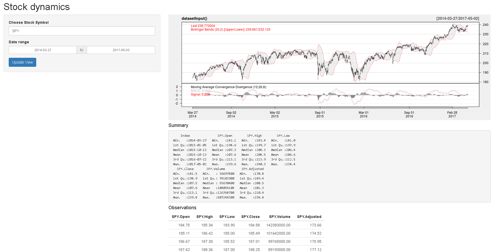

# DynamicStocks

## Live Sttaus: 

If you are ready to maximize your stock knowledge then [DyamicStocks](https://khushaljain1.shinyapps.io/DynamicStock-master/) is the web app for you.

Get the latest stock data.
***
## How-To
1. Run Shiny to RStudio.
  * Install shiny package in your RStudio.
  ```R
  install.packages("shiny")
  ```
  * create ui.R for frontend and server.R for backend, or you can create single file name app.R with server and ui codes inside.
  * run app, and it will launch localhost on browser automatically.
2. Run Shiny on your server.
  * [https://www.rstudio.com/products/shiny/download-server/](https://www.rstudio.com/products/shiny/download-server/)
  * [https://www.digitalocean.com/community/tutorials/how-to-set-up-shiny-server-on-ubuntu-14-04](https://www.digitalocean.com/community/tutorials/how-to-set-up-shiny-server-on-ubuntu-14-04) 


DynamicStocks helps in assessing monetary risk associated with different stocks (NASDAQ stocks currently). The application is hosted on a GCP VM temporarily for demonstration purpose.
This web address is likely to change in near future.

The codes behind the application (local app version) is also part of the repository. The UI of the app was developed keeping large screen devices, like laptop or desktop, in mind and hence the app UI is not suitable for mobile or tablet devices (you can still use it by changing the setting in the mobile browser to "Desktop Site" but there will be a skew here and there).

This application has been developed in RShiny using R programming language. To quote the disclaimer associated with using this app: R is free software and comes with ABSOLUTELY NO WARRANTY.

I have tried to keep all the calculations accurate to the best of my knowledge on the subject and programming nuances associated with R.

Hence, use this application along with guidance from your judgement. I take no ownership of success or failure (hopefully success to you) that you will meet with the aid from this app.

## Screenshoot


## I would like to thank the

1) Authors of the base R functions and following packages:
quantmod, dplyr, DT, GA, shiny, shinythemes, shinydashboard, shinyWidgets, shinyjs, shinyalert, shinyFeedback, ggplot2, shinyBS, shinyjs, shinycssloaders, gtable, grid, gridExtra

2) Author of Quantitative Financial Risk Management, Michael B Miller, the book has been helpful in increasing my knowledge on the subject

3) The community of R users whose contribution through many programming solutions over the internet has always helped me resolve my code bugs

Hope you enjoy using this app!


[Khushal Jain](https://github.com/85599)
